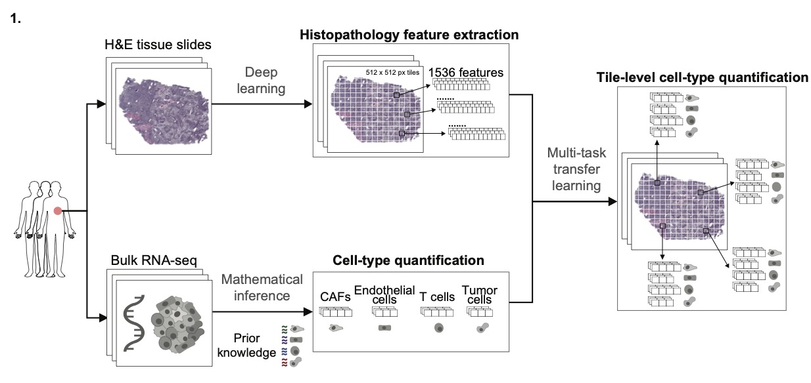
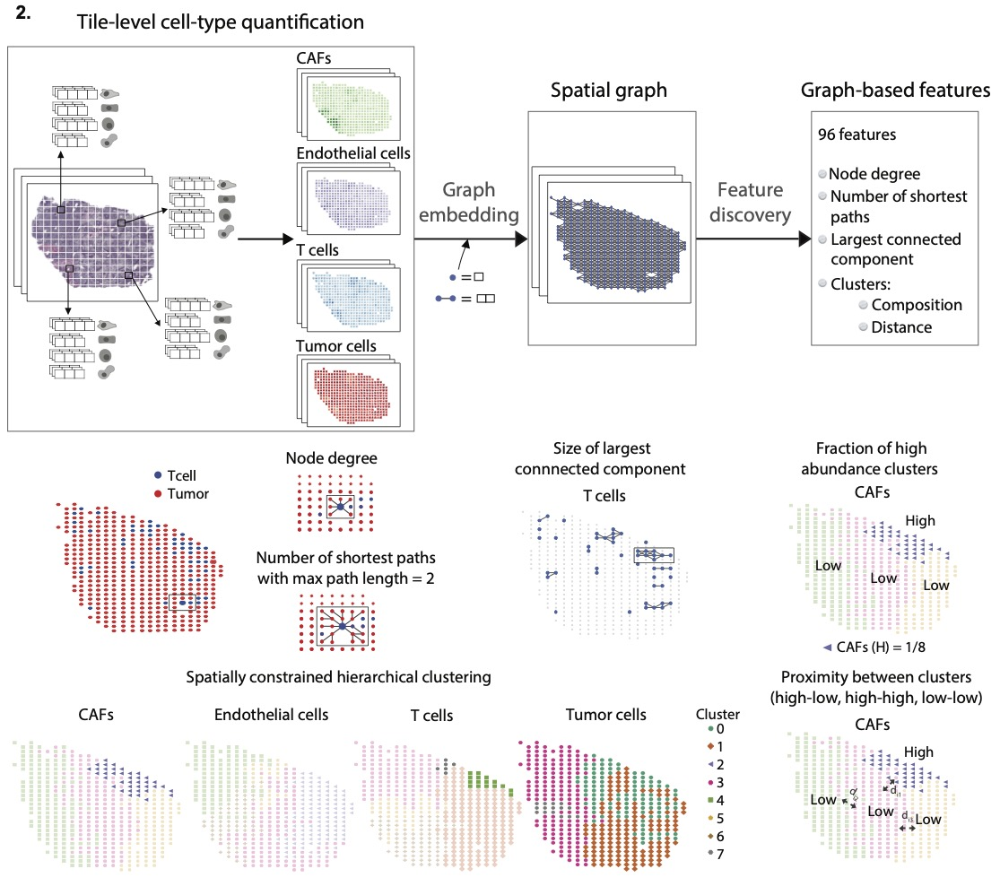

# Spatial Profiling of Tumors by Leveraging Imaging and Transcriptomics (SPoTLIghT)

Our pipeline, SPoTLIghT, as presented in our [paper](https://www.nature.com/articles/s41698-024-00749-w), can be used to derive spatial graph-based interpretable features from H&E slides and is available as a Nextflow pipeline.

The pipeline comprises the following modules:
1.  Extracting histopathological features
2.  Deconvolution of bulkRNAseq data
3.  Building a multi-task cell type model to predict cell type abundances on a tile-level 
4.  Predicting tile-level cell type abundances using the multi-task models
5.  Compute spatial features using the tile-level cell type abundances

> The building of the cell type models have only been tested using fresh frozen (FF) slides for the TCGA-SKCM dataset (melanoma) as described in the paper, for which the models are provided [here](assets/TF_models).

See also the figures below.




## Software

* Docker: `27.2.0`
* Apptainer: `1.0.2`
* Nextflow: `24.04.4 build 5917`

> These were the versions used for testing the pipeline.

## Set up
1. Create apptainer/singularity containers from Docker images:

```bash
# 1. save docker as tar or tar.gz (compressed)
docker save joank23/spotlight -o spotlight.tar.gz
# 2. build apptainer (.sif) from docker (.tar)
apptainer build spotlight.sif docker-archive:spotlight.tar.gz

# 1. save docker as tar or tar.gz (compressed)
docker save joank23/immunedeconvr -o immunedeconvr.tar.gz
# 2. build apptainer (.sif) from docker (.tar)
apptainer build immunedeconvr.sif docker-archive:immunedeconvr.tar.gz

```

2. Download retrained models to extract the histopathological features, available from Fu et al., Nat Cancer, 2020 ([Retrained_Inception_v4](https://www.ebi.ac.uk/biostudies/bioimages/studies/S-BSST292)). Once you unzip the folder, extract the files to the `data/checkpoint/Retrained_Inception_v4/` folder.
## Quick Start

1. [Building cell type models](docs/buildingmodels.md)
2. [Extracting spatial features using SKCM cell type models](docs/examples.md)

For more information, please read [docs/README.md](docs/README.md)

## Citing SPoTLIghT

If you use SPoTLIghT, please cite our paper: 

Lapuente-Santana, Ó., Kant, J. & Eduati, F. Integrating histopathology and transcriptomics for spatial tumor microenvironment profiling in a melanoma case study. npj Precis. Onc. 8, 254 (2024). https://doi.org/10.1038/s41698-024-00749-w

