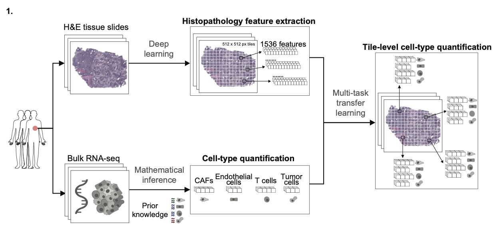
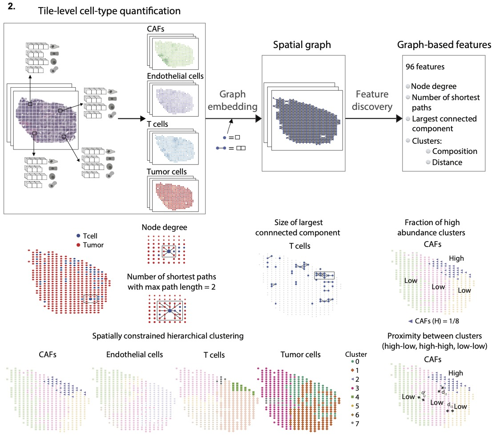

# SysBioOncology/SPoTLIghT

[](https://www.nextflow.io/)[](https://sylabs.io/docs/)

## Introduction

Our pipeline, SPoTLIghT, as presented in our [paper](https://www.nature.com/articles/s41698-024-00749-w), can be used to derive spatial graph-based interpretable features from H&E slides and is available as a Nextflow pipeline.

The pipeline comprises the following modules:

1. Extracting histopathological features
2. Deconvolution of bulkRNAseq data
3. Building a multi-task cell type model to predict cell type abundances on a tile-level
4. Predicting tile-level cell type abundances using the multi-task models
5. Compute spatial features using the tile-level cell type abundances

> The training of the cell type models have been perfomed using fresh frozen (FF) slides for the TCGA-SKCM dataset (melanoma) as described in the paper. The trained models are provided [here](assets/TF_models).

See also the figures below.




## Usage

### Software

- Docker version 28.0.4, build b8034c0
- Apptainer version 1.0.
- Nextflow version 24.10.5 build 5935

> These were the versions used for testing the pipeline.

> [!NOTE]
> If you are new to Nextflow and nf-core, please refer to [this page](https://nf-co.re/docs/usage/installation) on how to set-up Nextflow.

1. Create apptainer/singularity containers from Docker images

```sh
# Easiest route (internet access needed)
apptainer build spotlight.sif docker://joank23/spotlight
apptainer build immunedeconvr.sif docker://joank23/immunedeconvr

# Alternative route
# Usecase: if working on an HPC that does not have docker & internet access for building the image

# A) on you local desktop
# 1. save docker as tar or tar.gz (compressed)
docker pull joank23/spotlight
docker pull joank23/immunedeconvr
docker save joank23/spotlight > spotlight.tar
docker save joank23/immunedeconvr > immunedeconvr.tar

# 2. Move to HPC (optionally)
# 3. Build apptainer images (.sif) from docker (.tar) 
apptainer build spotlight.sif docker-archive:spotlight.tar
apptainer build immunedeconvr.sif docker-archive:immunedeconvr.tar

```

2. Download retrained models to extract the histopathological features, available from Fu et al., Nat Cancer, 2020
   1. Download from ([Retrained_Inception_v4](https://www.ebi.ac.uk/biostudies/bioimages/studies/S-BSST292))
   2. Unzip the folder
   3. Extract the files to a folder called `Retrained_Inception_v4`.

> IMPORTANT: Please rename your images file names, so they only include "-", to follow the same sample coding used by the TCGA.

Now, you can run the pipeline using:

<!-- TODO nf-core: update the following command to include all required parameters for a minimal example -->

Since the SKCM multi-task models are provided, the ['example_workflow_params.yml'](assets/example_workflow_params.yml) can be used to predict the cell type abundances for other H&E images and optionally to compute the spatial features.  

For more information see [examples](docs/skcm_examples.md).

```bash
nextflow run SysBioOncology/SPoTLIghT \
   -profile <docker/singularity/.../institute> \
   -params-file assets/example_workflow_params.yml \
   --outdir <OUTDIR>
```

> [!WARNING]
> Please provide pipeline parameters via the CLI or Nextflow `-params-file` option. Custom config files including those provided by the `-c` Nextflow option can be used to provide any configuration _**except for parameters**_; see [docs](https://nf-co.re/docs/usage/getting_started/configuration#custom-configuration-files).

## Credits

SysBioOncology/SPoTLIghT was originally written by Joan Kant, Óscar Lapuente-Santana & Federica Eduati.

## Contributions and Support

If you would like to contribute to this pipeline, please see the [contributing guidelines](.github/CONTRIBUTING.md).

## Citations

Lapuente-Santana, Ó., Kant, J. & Eduati, F. Integrating histopathology and transcriptomics for spatial tumor microenvironment profiling in a melanoma case study. npj Precis. Onc. 8, 254 (2024). <https://doi.org/10.1038/s41698-024-00749-w>

<!-- TODO nf-core: Add bibliography of tools and data used in your pipeline -->

An extensive list of references for the tools used by the pipeline can be found in the [`CITATIONS.md`](CITATIONS.md) file.

This pipeline uses code and infrastructure developed and maintained by the [nf-core](https://nf-co.re) community, reused here under the [MIT license](https://github.com/nf-core/tools/blob/main/LICENSE).

> **The nf-core framework for community-curated bioinformatics pipelines.**
>
> Philip Ewels, Alexander Peltzer, Sven Fillinger, Harshil Patel, Johannes Alneberg, Andreas Wilm, Maxime Ulysse Garcia, Paolo Di Tommaso & Sven Nahnsen.
>
> _Nat Biotechnol._ 2020 Feb 13. doi: [10.1038/s41587-020-0439-x](https://dx.doi.org/10.1038/s41587-020-0439-x).
